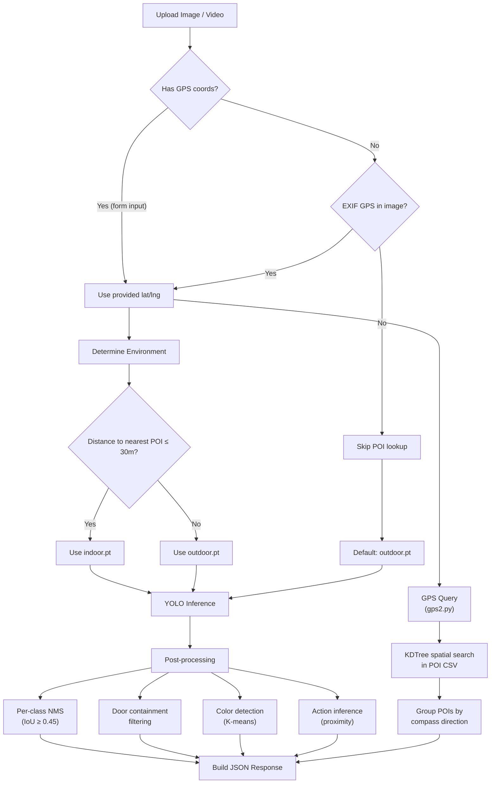
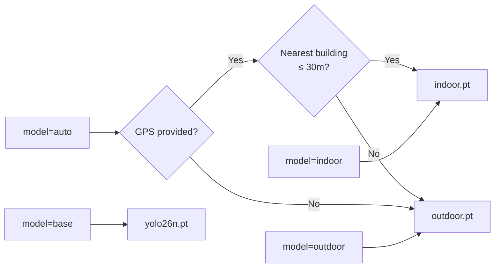

# Walkthrough: Surrounding Awareness — From Scratch to Running

> **Module**: [final4.py](file:///d:/Code/Python/brin/final4.py) (v2 — Dynamic Location)
>
> This guide takes you from a fresh `git clone` to a fully running system that
> analyses images/videos with YOLO and resolves GPS-based Points of Interest for
> any location on earth — all with a single command.

---

## Table of Contents

1. [What This Project Does](#1-what-this-project-does)
2. [Prerequisites](#2-prerequisites)
3. [Quick Start (One Command)](#3-quick-start-one-command)
4. [Step-by-Step Setup from Scratch](#4-step-by-step-setup-from-scratch)
5. [Using Your Own GPS Location](#5-using-your-own-gps-location)
6. [API Reference](#6-api-reference)
7. [Architecture Overview](#7-architecture-overview)
8. [Optional: Google Maps Review Enrichment](#8-optional-google-maps-review-enrichment)
9. [Troubleshooting](#9-troubleshooting)

---

## 1. What This Project Does

This system provides **surrounding awareness** by combining two capabilities:

| Capability | How |
|---|---|
| **Visual detection** | YOLO models detect objects (cars, bicycles, doors, chairs…), people, and actions (walking, sitting, eating…) in images or videos |
| **Spatial context** | GPS coordinates are matched against Points of Interest (POIs) fetched from OpenStreetMap to tell you *what buildings/places are nearby and in which direction* |

The system **dynamically selects** which YOLO model to use (`indoor.pt` vs `outdoor.pt`) based on your GPS proximity to known buildings.

### Key Modules

| File | Role |
|---|---|
| [final4.py](file:///d:/Code/Python/brin/final4.py) | Main API server — FastAPI app with all endpoints |
| [gps2.py](file:///d:/Code/Python/brin/gps2.py) | POI direction awareness — finds nearby buildings by compass direction |
| [fetch_poi2.py](file:///d:/Code/Python/brin/fetch_poi2.py) | Dynamic POI fetcher — queries OpenStreetMap's Overpass API for any location |
| [color.py](file:///d:/Code/Python/brin/color.py) | Dominant color detection via K-means clustering |
| [enrich_reviews.py](file:///d:/Code/Python/brin/enrich_reviews.py) | *(Optional)* Google Maps review scraping via Selenium |

---

## 2. Prerequisites

### Required Software

| Software | Minimum Version | Check With |
|---|---|---|
| **Python** | 3.9+ (recommended 3.10–3.11) | `python --version` |
| **pip** | 21+ | `pip --version` |
| **Git** | Any | `git --version` |

### Required Model Files (`.pt`)

Three YOLO model weight files must exist in the project root:

| File | Purpose | Size |
|---|---|---|
| `indoor.pt` | Indoor scene detection model | ~5.4 MB |
| `outdoor.pt` | Outdoor scene detection model | ~5.4 MB |
| `yolo26n.pt` | Base YOLO model (fallback) | ~5.5 MB |

> [!IMPORTANT]
> These `.pt` model files are included in the repository. If you cloned with
> `git clone`, they should already be present. Verify with:
> ```bash
> ls *.pt      # Linux/macOS
> dir *.pt     # Windows
> ```
> You should see `indoor.pt`, `outdoor.pt`, and `yolo26n.pt`.

### Data Files (Included)

| File | Purpose |
|---|---|
| [poi_buildings_english.csv](file:///d:/Code/Python/brin/poi_buildings_english.csv) | Default POI dataset (NCU campus, Taiwan) — used for indoor/outdoor detection |
| [requirements.txt](file:///d:/Code/Python/brin/requirements.txt) | Python dependency list |

---

## 3. Quick Start (One Command)

If you just want to get running as fast as possible:

```bash
# 1. Clone the repository
git clone <repository-url>
cd brin

# 2. Install dependencies + launch the server (single command)
pip install -r requirements.txt && python -m uvicorn final4:app --reload --port 8000
```

That's it! The server is running and ready to receive API requests.

> [!TIP]
> **Using your own location?** See [Section 5](#5-using-your-own-gps-location)
> to fetch POIs for any GPS coordinate before analysing images.

---

## 4. Step-by-Step Setup from Scratch

### Step 1 — Clone the Repository

```bash
git clone <repository-url>
cd brin
```

### Step 2 — Create a Virtual Environment (Recommended)

A virtual environment keeps dependencies isolated from your system Python.

**Windows (PowerShell):**
```powershell
python -m venv venv
.\venv\Scripts\Activate.ps1
```

**Windows (Command Prompt):**
```cmd
python -m venv venv
.\venv\Scripts\activate.bat
```

**macOS / Linux:**
```bash
python3 -m venv venv
source venv/bin/activate
```

### Step 3 — Install Dependencies

```bash
pip install -r requirements.txt
```

This installs:

| Package | Purpose |
|---|---|
| `fastapi`, `uvicorn` | Web API server |
| `python-multipart` | File upload parsing |
| `ultralytics` | YOLO model inference |
| `opencv-python`, `pillow` | Image/video processing, EXIF reading |
| `numpy`, `scipy` | Math, spatial indexing (KDTree) |
| `requests` | HTTP calls (Overpass API, IP geolocation) |
| `selenium`, `webdriver-manager` | *(Optional)* Google Maps review scraping |

### Step 4 — Verify Model Files

Ensure the three `.pt` files exist in the project root:

```bash
# Should print: indoor.pt  outdoor.pt  yolo26n.pt
ls *.pt        # Linux/macOS
dir *.pt       # Windows
```

### Step 5 — Start the Server

```bash
uvicorn final4:app --reload --port 8000
```

You should see:
```
INFO:     Uvicorn running on http://127.0.0.1:8000 (Press CTRL+C to quit)
```

---

## 5. Using Your Own GPS Location

The project ships with a default POI dataset for **NCU campus in Taiwan**. To use it for **your own location** anywhere in the world, you need to fetch POIs from OpenStreetMap for your area. There are two ways:

### Option A: Via the API (Recommended)

With the server running, send a POST request to fetch POIs for your coordinates:

```bash
curl -X POST "http://localhost:8000/api/fetch-pois" \
  -H "Content-Type: application/json" \
  -d '{
    "lat": 40.7128,
    "lng": -74.0060,
    "radius_m": 1000
  }'
```

Replace `40.7128, -74.0060` with **your GPS coordinates** (decimal degrees).

This will:
1. Query the OpenStreetMap Overpass API for buildings and POIs within the radius
2. Save the results to `poi_seed.csv`
3. Return the found POIs in the response

Now when you analyse images with those GPS coordinates, the system will use the freshly fetched POI data.

### Option B: Via Command Line

```bash
python fetch_poi2.py --mode osm --lat YOUR_LAT --lng YOUR_LNG --radius 1000
```

Example for New York City:
```bash
python fetch_poi2.py --mode osm --lat 40.7128 --lng -74.0060 --radius 1000
```

### Option C: Auto-detect Location (via IP)

Let the system detect your location automatically:

```bash
python fetch_poi2.py --mode osm --auto
```

Or via API:
```bash
# First, detect your location
curl http://localhost:8000/api/location/auto

# Then fetch POIs using the returned coordinates
curl -X POST "http://localhost:8000/api/fetch-pois" \
  -H "Content-Type: application/json" \
  -d '{"lat": <returned_lat>, "lng": <returned_lng>, "radius_m": 1000}'
```

### How to Find Your GPS Coordinates

1. Open **Google Maps** in your browser
2. Right-click on your location
3. Click the coordinates that appear (they get copied to your clipboard)
4. Use the format: `lat, lng` (e.g., `40.7128, -74.0060`)

---

## 6. API Reference

All endpoints are served at `http://localhost:8000`.

### Health Check

```
GET /api/health
```
Returns `{"status": "ok", "version": "2.0.0"}`.

---

### Analyze Image or Video

```
POST /api/analyze
```

**Content-Type**: `multipart/form-data`

| Field | Type | Required | Description |
|---|---|---|---|
| `image` | File | ✅ | Image (`.jpg`, `.png`) or video (`.mp4`, `.mov`, `.avi`) file |
| `lat` | float | ❌ | Latitude in decimal degrees. Falls back to EXIF if not provided |
| `lng` | float | ❌ | Longitude in decimal degrees |
| `altitude` | float | ❌ | Altitude above sea level (metres) for floor estimation |
| `gps_radius` | float | ❌ | POI search radius in metres (default: `500`) |
| `model` | string | ❌ | `"auto"` (default), `"indoor"`, `"outdoor"`, or `"base"` |
| `indoor_radius_m` | float | ❌ | Distance threshold for indoor classification (default: `30`) |
| `sample_interval_sec` | float | ❌ | Video: seconds between sampled frames (default: `1.0`) |
| `max_frames` | int | ❌ | Video: max frames to sample (default: `30`) |
| `poi_csv` | string | ❌ | Custom POI CSV filename (default: `poi_buildings_english.csv`) |

**Example — Image analysis with GPS:**
```bash
curl -X POST "http://localhost:8000/api/analyze" \
  -F "image=@photo.jpg" \
  -F "lat=40.7128" \
  -F "lng=-74.0060" \
  -F "model=auto"
```

**Example — Video analysis:**
```bash
curl -X POST "http://localhost:8000/api/analyze" \
  -F "image=@video.mp4" \
  -F "lat=40.7128" \
  -F "lng=-74.0060" \
  -F "sample_interval_sec=2" \
  -F "max_frames=15"
```

**Response structure** (image):
```json
{
  "media_type": "image",
  "objects": {
    "car": { "count": 3, "instances": [{"id": 0, "confidence": 0.87, "colors": ["white", "gray"]}] },
    "door": { "count": 1, "instances": [...] }
  },
  "actions": {
    "walking": { "count": 2 },
    "sitting": { "count": 1 }
  },
  "doors": [
    { "id": 0, "confidence": 0.92, "direction": "front", "description": "There is a door on your front" }
  ],
  "summary": { "car": 3, "door": 1, "walking": 2, "sitting": 1 },
  "gps": {
    "source": "user_input",
    "lat": 40.7128,
    "lng": -74.006,
    "poi_result": {
      "directions": { "North": [...], "South-East": [...] },
      "nearest": { "name": "City Hall", "distance_m": 120.5, "direction": "North" },
      "total_pois_found": 15
    }
  },
  "floor": null,
  "model_info": {
    "mode": "auto",
    "selected": "outdoor",
    "model_file": "outdoor.pt",
    "reason": "Auto: nearest POI 'City Hall' is 120.5 m away (> 30 m threshold)"
  }
}
```

---

### Auto-detect Location

```
GET /api/location/auto
```

Detects the server's location via IP geolocation.

**Response:**
```json
{
  "status": "ok",
  "location": {
    "lat": 24.968,
    "lng": 121.191,
    "city": "Zhongli",
    "region": "Taoyuan",
    "country": "Taiwan"
  }
}
```

---

### Fetch POIs for a Location

```
POST /api/fetch-pois
```

**Content-Type**: `application/json`

| Field | Type | Required | Description |
|---|---|---|---|
| `lat` | float | ✅ | Center latitude |
| `lng` | float | ✅ | Center longitude |
| `radius_m` | float | ❌ | Search radius in metres (default: `1000`, range: `50–50000`) |
| `output_file` | string | ❌ | Custom output CSV filename (default: `poi_seed.csv`) |

**Example:**
```bash
curl -X POST "http://localhost:8000/api/fetch-pois" \
  -H "Content-Type: application/json" \
  -d '{"lat": 35.6812, "lng": 139.7671, "radius_m": 500}'
```

---

### Enrich POIs with Reviews (Optional)

```
POST /api/enrich
```

**Content-Type**: `application/json`

| Field | Type | Required | Description |
|---|---|---|---|
| `input_csv` | string | ❌ | Input POI CSV (default: `poi_seed.csv`) |
| `output_csv` | string | ❌ | Output enriched CSV (default: `poi_enriched.csv`) |
| `reviews_json` | string | ❌ | Output reviews JSON (default: `reviews.json`) |
| `max_reviews` | int | ❌ | Max reviews per POI (default: `20`, range: `1–100`) |

> [!WARNING]
> This endpoint requires Selenium and Chrome/Chromium to be installed.
> Google Maps may block automated scraping. This step is entirely **optional**.

---

---

## 7. Architecture Overview

### Pipeline Flow



### Detection Labels

The YOLO models detect 16 classes plus a `door` class:

**Objects:** `person`, `bicycle`, `bus`, `car`, `chair`, `clothe`, `motorcycle`, `shelter`, `sign`, `traffic light`, `truck`, `water bottle`, `door`

**Actions (direct):** `Walking`, `smiling`, `person eating`, `person sitting`, `person standing`

**Actions (inferred by proximity):** `cycling` (person + bicycle), `riding motorcycle` (person + motorcycle), `riding in car/truck/bus` (person + vehicle)

### Model Selection Logic



---

## 8. Optional: Google Maps Review Enrichment

After fetching POIs, you can optionally enrich them with Google Maps data (ratings, review counts, opening hours). This step requires additional dependencies.

### Additional Requirements

- **Chrome** or **Chromium** browser installed on your system
- Python packages: `selenium`, `webdriver-manager` (already in `requirements.txt`)

### Usage

**Via command line:**
```bash
# Basic enrichment
python enrich_reviews.py --input poi_seed.csv

# With visible browser for debugging
python enrich_reviews.py --input poi_seed.csv --visible --max-reviews 5
```

**Via API:**
```bash
curl -X POST "http://localhost:8000/api/enrich" \
  -H "Content-Type: application/json" \
  -d '{"input_csv": "poi_seed.csv", "max_reviews": 10}'
```

> [!NOTE]
> Google Maps actively blocks automated scraping. The enrichment uses
> anti-detection measures but may fail. All failures are handled gracefully
> per-POI — the rest of the pipeline works without it.

---

## 9. Troubleshooting

### Common Issues

| Problem | Solution |
|---|---|
| `ModuleNotFoundError: No module named 'ultralytics'` | Run `pip install -r requirements.txt` |
| `FileNotFoundError: indoor.pt` | Ensure model files are in the project root directory |
| `Could not decode image` | Verify the uploaded file is a valid image (JPEG, PNG) or video (MP4, MOV, AVI) |
| Server starts but GPS/POI returns empty | Fetch POIs for your location first — see [Section 5](#5-using-your-own-gps-location) |
| Overpass API timeout | The free OSM API has rate limits. Wait a minute and try again; the system retries 3 mirror servers automatically |
| `CORS error` in browser | The server allows all origins by default. Check your browser extensions |
| Enrichment fails (`selenium` error) | Chrome/Chromium must be installed. This step is optional |

### Port Already in Use

If port 8000 is occupied, use a different port:

```bash
uvicorn final4:app --reload --port 8080
```

### Performance Tips

- The first request after server start is slower (model loading). Subsequent requests are fast (~5 MB models are cached in memory).
- For video analysis, increase `sample_interval_sec` to reduce processing time (e.g., `2.0` or `3.0`).
- Limit `max_frames` if you only need a quick summary.

---

## Complete Reproducible Workflow

Here's the **full end-to-end workflow** for a new user at any location:

```bash
# 1. Clone and setup
git clone <repository-url>
cd brin
pip install -r requirements.txt

# 2. Launch the server
uvicorn final4:app --reload --port 8000

# 3. (In a new terminal) Fetch POIs for your location
#    Replace coordinates with your own (get them from Google Maps → right-click)
curl -X POST "http://localhost:8000/api/fetch-pois" \
  -H "Content-Type: application/json" \
  -d '{"lat": YOUR_LAT, "lng": YOUR_LNG, "radius_m": 1000}'

# 4. Analyse an image with your GPS coordinates
curl -X POST "http://localhost:8000/api/analyze" \
  -F "image=@your_photo.jpg" \
  -F "lat=YOUR_LAT" \
  -F "lng=YOUR_LNG" \
  -F "poi_csv=poi_seed.csv"

```
